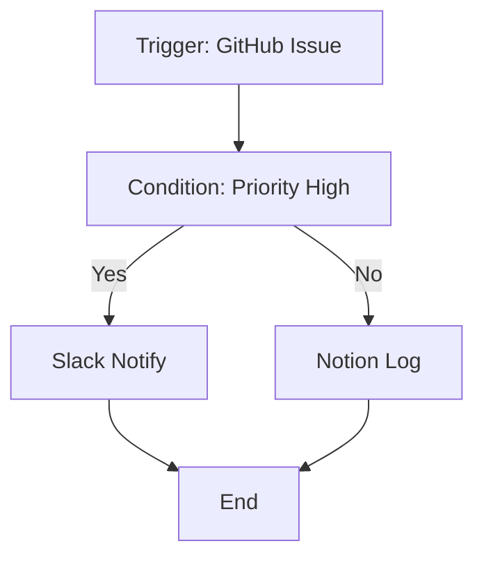

## Overview

MCP Hub empowers you to automate repetitive tasks across your tools like GitHub, Slack, and Notion. Build visual workflows, trigger them in real-time, monitor performance with analytics, and collaborate securely in team workspaces.

<Columns cols={2}>
  <Card title="Visual Workflow Editor" icon="edit-3" href="#visual-workflow-editor">
    Drag-and-drop interface to connect actions without code.
  </Card>
  <Card title="Real-time Execution" icon="zap" href="#real-time-execution">
    Instant triggers via webhooks, schedules, or manual runs.
  </Card>
  <Card title="Analytics Dashboard" icon="bar-chart-3" href="#analytics-dashboard">
    Track executions, errors, and performance metrics.
  </Card>
  <Card title="Team Workspaces" icon="users" href="#team-workspaces">
    Role-based access and shared automation management.
  </Card>
</Columns>

## Visual Workflow Editor

Create complex automations using a drag-and-drop editor. Connect tools like GitHub issues to Slack notifications or Notion databases without writing code.

<Steps>
  <Step title="Add Tools" icon="plus">
    Select from connected services such as GitHub or Slack.
  </Step>
  <Step title="Drag Actions" icon="move">
    Link triggers to actions, like "new issue" to "post message".
  </Step>
  <Step title="Add Logic" icon="settings">
    Insert conditions, loops, or error handlers.
  </Step>
  <Step title="Test and Save" icon="play">
    Run a preview and publish your workflow.
  </Step>
</Steps>

<Callout kind="tip">
  Save workflows as templates to reuse across projects.
</Callout>



## Real-time Execution and Triggers

Execute workflows instantly with flexible triggers. Monitor live progress and handle errors automatically.

<Tabs>
  <Tab title="Webhook" icon="zap">
    Receive events from external services.

    <Request tabs="cURL,JavaScript" show-lines="true">
      ```bash
curl -X POST https://api.example.com/workflows/{workflowId}/trigger \
  -H "Authorization: Bearer YOUR_TOKEN" \
  -H "Content-Type: application/json" \
  -d '{
    "event": "issue_created",
    "data": {"repo": "my-repo", "issue": 123}
  }'
      ```

      ```javascript
const response = await fetch('https://api.example.com/workflows/{workflowId}/trigger', {
  method: 'POST',
  headers: {
    'Authorization': 'Bearer YOUR_TOKEN',
    'Content-Type': 'application/json'
  },
  body: JSON.stringify({
    event: 'issue_created',
    data: { repo: 'my-repo', issue: 123 }
  })
});
      ```
    </Request>
  </Tab>
  <Tab title="Schedule" icon="clock">
    Run on cron schedules like every hour.
  </Tab>
  <Tab title="Manual" icon="play">
    Trigger from the dashboard UI.
  </Tab>
</Tabs>

## Analytics Dashboard

Gain insights into your automations with a real-time dashboard. View execution history, success rates, and bottlenecks.

| Metric | Description | Example Value |
|--------|-------------|---------------|
| Total Runs | Number of workflow executions | `>10,000` |
| Success Rate | Percentage of successful runs | `99.5%` |
| Avg Duration | Average execution time | `<2s` |
| Error Rate | Failed runs by type | `0.2% timeouts` |

<Expandable title="Advanced Metrics" default-open="false">
  Drill down into per-tool performance and custom alerts for thresholds.
</Expandable>

## Team Workspaces and RBAC

Organize automations in shared workspaces with role-based access control (RBAC). Assign viewer, editor, or admin roles.

<Board title="Workspace Workflow Pipeline">
  <BoardColumn title="Draft" color="0" icon="edit">
    <BoardCard title="GitHub to Slack Notify" description="Alert team on high-priority issues" icon="zap" />
  </BoardColumn>
  <BoardColumn title="Active" color="1" icon="play">
    <BoardCard title="Notion Sync" description="Update database from GitHub PRs" dueDate="2024-12-31" author="Alice" />
  </BoardColumn>
  <BoardColumn title="Archived" color="2" icon="archive">
    <BoardCard title="Old Report Generator" createdAt="2024-11-15" />
  </BoardColumn>
</Board>

<Callout kind="info">
  Audit logs track all changes for compliance.
</Callout>

<Columns cols={2}>
  <Card title="Next: Quickstart" icon="book-open" href="/quickstart">
    Set up your first workflow.
  </Card>
  <Card title="API Reference" icon="code" href="/authentication">
    Integrate programmatically.
  </Card>
</Columns>